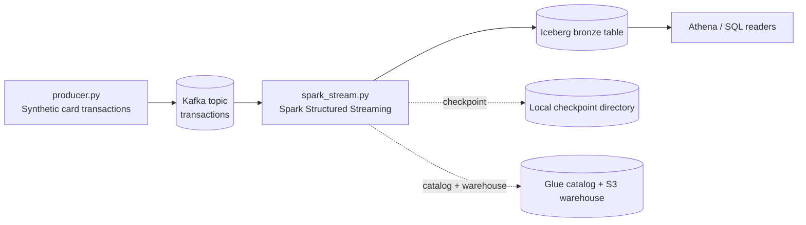

# Real-Time Transaction Reconciliation

This repository models a real-time transaction pipeline for card payments and the reconciliation controls around it. The current implementation is intentionally small, but the architecture is the same one you would use in production: produce events, stream them through Kafka, transform them with Spark Structured Streaming, and land them in an Iceberg table that is queryable through a catalog.

## Architecture



The code in this repo is split into four runtime paths:

1. `dev/producer.py` generates synthetic JSON transactions and writes them to Kafka.
2. `dev/spark_stream.py` reads the Kafka topic, parses the JSON into typed columns, and writes both bronze and streaming aggregate Iceberg tables.
3. `dev/batch_aggregations.py` computes daily batch aggregates from bronze and writes `glue.db.transactions_batch_agg`.
4. `dev/reconcile.py` compares batch and stream aggregates and reports match/mismatch by date and merchant.

The target storage/catalog path in the streaming job is Glue + S3. That makes the table queryable by engines such as Athena without changing the write path.

## What runs where

- Kafka runs locally in Docker through `dev/docker-compose.yml`.
- The producer runs as a normal Python process on the developer machine.
- Spark runs locally through PySpark, but the job is configured like a cloud writer: it uses an Iceberg catalog, an S3 warehouse location, and a local checkpoint.
- `dev/read_iceberg.py` is a small verification helper that reads Glue-backed Iceberg tables through Spark.
- `dev/spark_check.py` is a bootstrap test that confirms Spark can start before running the streaming job.

## Tech stack

- Apache Kafka 3.7.0 in KRaft mode, started with Docker Compose
- Python producer using `kafka-python`
- Apache Spark 3.5.1 with PySpark Structured Streaming
- Apache Iceberg 1.9.1 for the table format
- AWS Glue Data Catalog and Amazon S3 for the target catalog and warehouse
- Athena as the SQL reader for the Iceberg table

## Current status

- Kafka broker: implemented locally through Docker Compose
- Synthetic event producer: implemented in `dev/producer.py`
- Streaming ingestion: implemented in `dev/spark_stream.py`
- Iceberg verification reader: implemented in `dev/read_iceberg.py`
- Batch aggregation job: implemented in `dev/batch_aggregations.py`
- Reconciliation job: implemented in `dev/reconcile.py`

## Repository layout

- `dev/docker-compose.yml` starts the local Kafka broker
- `dev/producer.py` emits synthetic transaction events
- `dev/spark_stream.py` consumes Kafka and writes to Iceberg
- `dev/read_iceberg.py` reads the Iceberg table for verification
- `dev/batch_aggregations.py` computes batch aggregates from bronze
- `dev/reconcile.py` compares batch and stream aggregates
- `dev/spark_check.py` verifies Spark can start in the current environment

## Local setup

1. Start Kafka:

	```powershell
	docker compose -f dev/docker-compose.yml up -d
	```

2. Install Python dependencies:

	```powershell
	python -m pip install kafka-python pyspark==3.5.1
	```

3. Start the producer in one terminal:

	```powershell
	python dev/producer.py
	```

4. Start the streaming job in another terminal:

	```powershell
	python dev/spark_stream.py
	```

5. Optionally validate the Iceberg table read path:

	```powershell
	python dev/read_iceberg.py
	```

6. Build batch aggregates:

	```powershell
	python dev/batch_aggregations.py
	```

7. Run reconciliation between batch and stream aggregates:

	```powershell
	python dev/reconcile.py
	```

## AWS and Windows notes

- The streaming job expects AWS credentials to be available through the AWS CLI profile on the machine.
- The Iceberg warehouse location is configured to use S3.
- On Windows, Spark may require `JAVA_HOME` and `HADOOP_HOME`/`winutils.exe` for local execution.
- The current development environment keeps the Spark checkpoint on local disk; in a production deployment, that checkpoint should move to durable object storage.

## Production shape

This repo is a development version of a wider reconciliation platform. A realistic production version would usually add:

- durable checkpoint storage
- least-privilege AWS IAM permissions
- an orchestrated batch reconciliation job
- alerts for drift between source aggregates and streamed aggregates
- stronger schema evolution and data quality checks

## Troubleshooting

- If `python` is not recognized, use `python -m pip` and check the VS Code terminal PATH settings.
- If Spark fails on Windows with Hadoop-related errors, ensure `JAVA_HOME` is set and either provide `winutils.exe` or run the job in Docker/WSL/Linux.
- If Spark cannot find the Kafka source, make sure the Kafka connector package is included in the Spark session configuration.
- If you get `table not exists`, confirm both writer and reader jobs use the same Glue catalog prefix (`glue.db.*`), not a local catalog prefix (`local.db.*`).
- If reconciliation fails with unresolved `total_transaction_count`, use `total_transactions` from `transactions_batch_agg` and alias it during select.
- For stream aggregation, use Spark SQL `sum` from `pyspark.sql.functions` (for example `sum as spark_sum`) instead of Python built-in `sum`.