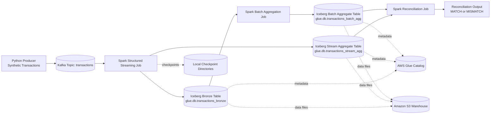

# Real-Time Transaction Reconciliation on Kafka, Spark, Iceberg, and Glue

## Project Summary

This project demonstrates a production-style data engineering pattern for financial transaction monitoring.

It builds a complete real-time reconciliation pipeline where:

1. card transactions are generated continuously,
2. ingested through Kafka,
3. processed with Spark Structured Streaming,
4. stored in Iceberg tables on S3 registered in AWS Glue,
5. compared against batch aggregates to detect drift.

The final output is a reconciliation report with MATCH or MISMATCH status by date and merchant.

## Business Problem

Payments systems need a reliable control to confirm that streaming metrics match batch truth.

This project solves that by implementing two independent aggregation paths and reconciling them:

1. Stream path: near real-time windowed metrics.
2. Batch path: daily aggregates from persisted raw data.
3. Reconciliation path: side-by-side comparison and variance calculation.

## End-to-End Architecture

## Data Flow Details

### 1) Ingestion

The producer emits transaction events with fields like transaction_id, card_id, amount, merchant, status, and event_time into Kafka topic transactions.

### 2) Streaming Transformation

The streaming job parses Kafka JSON payloads, writes raw records to a bronze Iceberg table, and simultaneously writes windowed merchant-level aggregates into a second Iceberg table.

### 3) Batch Aggregation

The batch job reads bronze data, computes daily metrics by merchant, and stores them in a batch aggregate Iceberg table.

### 4) Reconciliation

The reconciliation job compares stream and batch metrics by date and merchant, computes differences in count and amount, and labels each key as MATCH or MISMATCH.

## Tech Stack

1. Python 3.12
2. Apache Kafka 3.7 (local via Docker Compose)
3. Apache Spark 3.5.1 with Structured Streaming
4. Apache Iceberg 1.9.1 table format
5. AWS Glue Data Catalog
6. Amazon S3 warehouse

## Repository Structure

1. dev/docker-compose.yml: local Kafka setup
2. dev/producer.py: synthetic event generator
3. dev/spark_stream.py: Kafka to Iceberg bronze plus stream aggregate
4. dev/batch_aggregations.py: batch aggregate generation from bronze
5. dev/reconcile.py: reconciliation logic and mismatch detection
6. dev/read_iceberg.py: ad hoc Glue table validation query helper
7. dev/spark_check.py: Spark startup sanity check

## How to Run

### Prerequisites

1. Java installed and configured through JAVA_HOME
2. Hadoop winutils setup for Windows through HADOOP_HOME
3. Docker Desktop running
4. AWS credentials configured with Glue and S3 access

### Execution Steps

~~~powershell
# 1) Start Kafka
docker compose -f dev/docker-compose.yml up -d

# 2) Install dependencies
python -m pip install -r requirements.txt

# 3) Start event producer
python dev/producer.py

# 4) Start streaming pipeline (in a new terminal)
python dev/spark_stream.py

# 5) Build batch aggregates
python dev/batch_aggregations.py

# 6) Run reconciliation
python dev/reconcile.py

# 7) Optional table reads
python dev/read_iceberg.py
~~~

## Iceberg Tables Created

1. glue.db.transactions_bronze
2. glue.db.transactions_stream_agg
3. glue.db.transactions_batch_agg

## Reconciliation Output Columns

1. date
2. merchant
3. batch_total_transaction_count
4. stream_total_transaction_count
5. batch_total_amount
6. stream_total_amount
7. transaction_count_difference
8. total_amount_difference
9. reconciliation_status

## Engineering Highlights

1. Designed dual-path aggregation for data quality validation.
2. Implemented structured streaming with event-time windowing.
3. Used Glue plus Iceberg for open table format and metadata decoupling.
4. Kept raw bronze and derived aggregates separate for auditability.
5. Added reconciliation status logic usable for control dashboards and alerting.

## Troubleshooting Guide

1. Table not exists
   Cause: querying local catalog while writes are in Glue catalog.
   Fix: use glue.db table names consistently in all scripts.

2. Unresolved column total_transaction_count in batch table
   Cause: batch table column name is total_transactions.
   Fix: alias total_transactions as total_transaction_count in reconciliation select.

3. TypeError from sum on string
   Cause: Python built-in sum used instead of Spark SQL sum.
   Fix: import Spark sum from pyspark.sql.functions and use it in aggregations.

4. Spark UI port 4040 busy
   Cause: another Spark app already running.
   Fix: Spark auto-falls back to the next available port; this warning is safe.

## What to Improve Next

1. Move checkpoint paths from local disk to S3 for stronger recovery.
2. Partition Iceberg tables for faster analytical queries.
3. Add automated tests for schema and reconciliation assertions.
4. Add orchestration and scheduling for batch and reconciliation jobs.
5. Publish reconciliation metrics to a monitoring system.

## Why This Project Matters for Data Engineering Roles

This repository demonstrates practical experience in streaming, lakehouse table formats, cloud catalog integration, and data quality controls. It shows not only data movement, but also correctness validation, which is a core expectation in production data platforms.